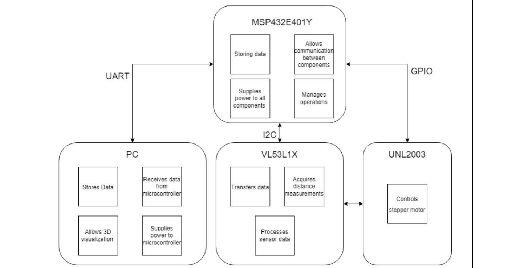
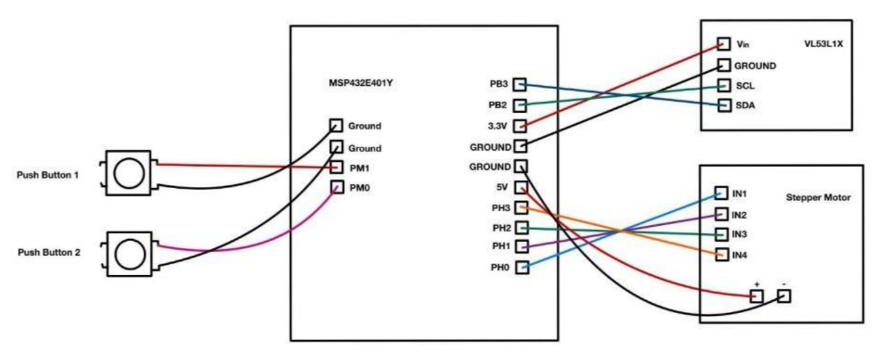
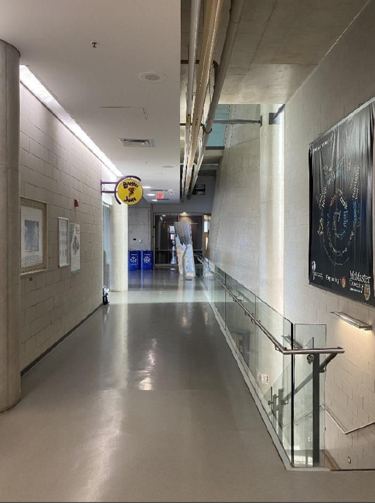
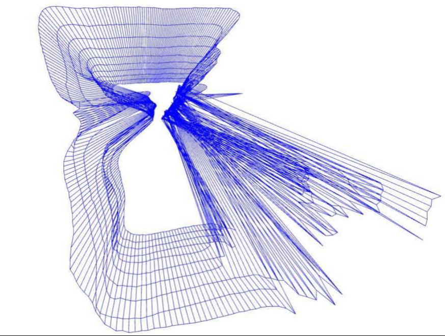
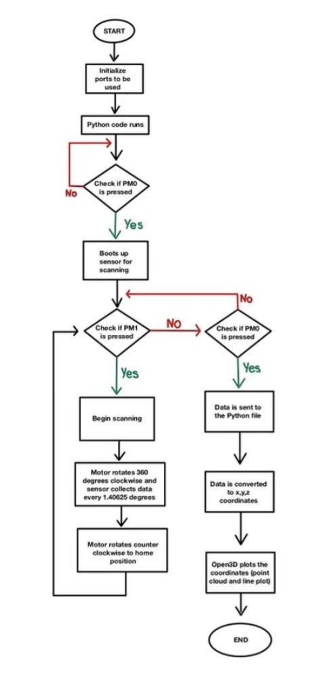

# Spatial Mapping: 360° ToF 3D Scanner

**An embedded system that combines motorized 360° scanning with real-time Time-of-Flight distance acquisition to generate 3D point-cloud visualizations of physical spaces.**


---

## 📋 Overview

This project is a self-contained embedded spatial mapping system built around the **VL53L1X Time-of-Flight (ToF) sensor**. A stepper motor rotates the sensor through a full 360° sweep, taking 256 distance measurements per rotation (one every 1.41°). Each measurement is streamed over serial to a PC, converted into 3D `(x, y, z)` coordinates, and rendered live as a point-cloud / wireframe visualization using Open3D.


**System pipeline:**

```
VL53L1X ToF Sensor → I2C → MSP432E401Y (TM4C1294) MCU → UART (115200 bps) → PC (Python) → Open3D 3D Visualization
                              ↑
                    Stepper Motor (GPIO, 360° sweep)
```

## 🏗️ Block Diagram



The MSP432E401Y microcontroller sits at the center of the system: it drives the stepper motor over GPIO, communicates with the VL53L1X sensor over I2C, and streams processed coordinate data to the PC over UART. The PC-side Python program stores the incoming data and renders it as a live 3D visualization.

## ✨ Features

- **Motorized 360° scanning:** a stepper motor rotates the ToF sensor in 1.41° increments, giving 256 distance samples per full rotation
- **Real-time distance acquisition:** the VL53L1X ToF sensor measures distance (up to 400 cm range, ±20 mm accuracy)
- **On-device coordinate calculation:** the MCU converts each polar `(distance, angle)` reading into Cartesian coordinates using quadrant-aware trigonometry (`y = r·cos(θ)`, `z = r·sin(θ)`), and increments the `x` axis with each new scan slice as the user moves forward
- **Serial streaming protocol:** coordinates are packet-framed with `$`/`@`/`!` delimiters over UART and parsed on the PC side into an `.xyz` point file
- **Live 3D visualization:** Python + Open3D renders both a raw point cloud and a connected line-set (wireframe) of the scanned environment in real time
- **Push-button controlled workflow:** one button starts/stops the overall session, the other triggers each new 360° scan slice as the user advances through a space
- **Status LEDs:** one LED blinks every 45° of rotation to indicate scanning progress; a second indicates motor return-to-home

## 🛠️ Tech Stack

| Layer | Technology |
|---|---|
| Microcontroller | Texas Instruments MSP432E401Y (ARM Cortex-M4F, 120 MHz core / 16 MHz bus) |
| Firmware | C (Keil uVision5, MDK-ARM) |
| Distance Sensor | VL53L1X Time-of-Flight sensor (ST Micro ULD API) |
| Motor & Driver | 28BYJ-48 stepper motor + ULN2003 driver |
| MCU ↔ Sensor | I2C @ 100 kHz |
| MCU ↔ PC | UART0 @ 115200 bps |
| Visualization | Python 3.10.6, PySerial, NumPy, Open3D |

## 📁 Repository Structure

```
spatial-mapping/
├── code/
│   ├── MAIN-CODE.c                     # Main firmware: init, scan loop, coordinate math, UART streaming
│   ├── VL53L1X_api.c / .h              # ST ULD driver for the VL53L1X ToF sensor
│   ├── vl53l1_platform*.c / .h         # I2C platform layer for the VL53L1X driver
│   ├── vl53l1_types*.h                 # Sensor driver type definitions
│   ├── PLL.c / .h                      # System clock (PLL) configuration
│   ├── SysTick.c / .h                  # SysTick timer / delay routines
│   ├── uart.c / .h                     # UART0 driver (MCU and PC communication)
│   ├── onboardLEDs.c / .h              # Onboard LED status indicators
│   ├── tm4c1294ncpdt.h                 # TM4C1294NCPDT (MSP432E401Y) register definitions
│   ├── visualization_livescan.py       # Live serial capture + real-time Open3D visualization
│   ├── visualization_static_xyzfile.py # Re-visualizes a previously captured .xyz file
│   └── ToF_XYZ_Data*.xyz               # Sample captured point-cloud data
├── datasheets/                         # VL53L1X datasheet, API/parameter docs, sensor schematic
└── project_documentation.pdf           # Full write-up: design, math, setup, results, limitations
```

## ⚙️ How It Works

1. **Boot & calibrate:** on startup, the MCU initializes the system clock (PLL), I2C, UART, GPIO ports, and also boots the VL53L1X sensor.

2. **Arm the system:** the user presses Button 2 (PM0) to initialize the ToF sensor and prepare it for scanning.

3. **Scanning a slice:** pressing Button 1 (PM1) starts a 360° sweep. For each of the 256 steps:
   - The motor advances 1.41°, driving Port H in a 4-phase sequence
   - The firmware polls the VL53L1X until a valid distance reading is ready (with a retry loop for range-status errors)
   - The raw distance and current angle are converted to `y`/`z` coordinates using quadrant-based trig; `x` stays fixed for the current slice
   - The `(x, y, z)` triple is packet-framed (`$x$@y@!z!`) and transmitted over UART
   - Status LEDs blink every 45° of rotation

4. **Return home:** after 256 steps, the motor spins back counter-clockwise to its home position (`stepReturn()`), and `x` is incremented by a fixed step for the next slice.

5. **Repeat or finish:** the user physically moves forward and presses Button 1 again to scan another slice, or presses Button 0 to terminate the session.
6. **3D Visualization:** on the PC, `visualization_livescan.py` reads the incoming serial stream, reconstructs each `(x, y, z)` triple, writes them to a `.xyz` point file, and renders the result with Open3D first as a raw point cloud, then as a connected wireframe (points along each scan ring and between adjacent rings/slices are joined into line sets).

## 🔧 Hardware & Wiring



| Component | Interface | MCU Pins |
|---|---|---|
| VL53L1X ToF Sensor | I2C | SDA → PB3, SCL → PB2, VIN → 3.3V, GND → GND |
| 28BYJ-48 Stepper + ULN2003 | GPIO | IN1–IN4 → PH0–PH3, + → 5V, − → GND |
| Push Button 1 (scan trigger) | GPIO input | PM1 |
| Push Button 2 (session start/stop) | GPIO input | PM0 |
| Status LED 1 (measurement status) | GPIO output | PF4 |
| Status LED 2 (rotation status) | GPIO output | PN1 |
| PC (UART) | UART0, 115200 bps | COM port over micro-USB |

## 🚀 Getting Started

### Prerequisites

- [Keil uVision5 / MDK-ARM](https://www2.keil.com/mdk5) and install the MSP432E401Y device family pack
- Python 3.10.6 or newer, added to your system PATH
- The physical hardware: MSP432E401Y microcontroller, VL53L1X ToF sensor, 28BYJ-48 stepper + ULN2003 driver, 2 push buttons

### 1️⃣ Flash the firmware

1. Open the `code/` folder as a project in Keil uVision5 (device: MSP432E401Y).
2. Connect the microcontroller via micro-USB (the port opposite the Ethernet jack).
3. Click **Translate**, **Build**, then **Download** in Keil.
4. Press the reset button on the board next to the micro-USB port.

### 2️⃣ Set up the Python environment

```bash
pip install pyserial
python -m pip install -U numpy
python -m pip install -U open3d
```

### 3️⃣ Configure the serial port

In `visualization_livescan.py`, update the COM port to match your system (found under **Device Manager → Ports**, listed as "XDS110 Class Application/User UART"):

```python
s = serial.Serial('COM5', 115200, timeout=10)
```

### 4️⃣ Run a scan

1. Run `visualization_livescan.py` and press **Enter** when prompted.
2. Press **Button 2 (PM0)** to initialize and boot the ToF sensor.
3. Press **Button 1 (PM1)** to begin scanning. The motor will sweep a full 360° while the sensor collects 256 distance samples.
4. Physically move forward a short distance and press **Button 1** again to capture another slice. Repeat as many times as needed.
5. Press **Button 2 (PM0)** to end the session and Open3D will automatically open and render the accumulated 3D scan.

❗*To re-visualize a previously saved `.xyz` file without a live sensor connected, use `visualization_static_xyzfile.py` instead.*

## 📊 Sample Result

A real hallway, scanned in 10 slices while walking forward, reconstructed as a 3D wireframe:




## 🔄 Flowchart




## 🔮 Future Improvements

- Move coordinate calculation off the MCU or upgrade to double-precision to reduce accumulated trigonometric error
- Replace manual slice-advancement (walking + button press) with an automated linear rail or odometry-based tracking
- Add live point cloud stitching/alignment between the slices instead of relying on a fixed, manually-set forward increment
- Export scans directly to standard 3D formats (e.g. `.ply`, `.pcd`) for use in other point-cloud tooling

